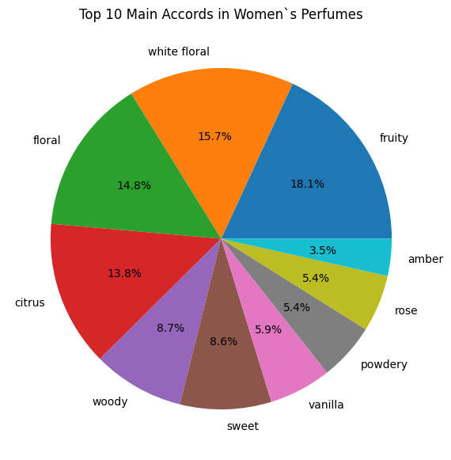

# Investigative Report: The Role and Importance of EDA in Women Perfume Recommendation

## 1. Introduction

Exploratory Data Analysis (EDA) is a fundamental step in any data-driven project. It involves systematically investigating datasets to understand their structure, discover patterns, spot anomalies, test a hypothesis, or check assumptions before applying machine learning or predictive models.

In my project, **"Women Perfume Recommendation Based on Note Similarities,"** the EDA process plays a crucial role in understanding the characteristics of the perfumes and ensuring the data is accurate and consistent before applying the **K-Nearest Neighbors (KNN)** algorithm for similarity-based recommendations.

This analysis focuses specifically on **women's perfumes**, aiming to explore how fragrance notes, accords, and descriptive attributes can be used to identify perfumes with similar scent profiles.

---

## 2. EDA Techniques Applied in This Project

### 1. Data Cleaning

The dataset initially contained 24,063 entries and included the following main columns:
`url`, `Perfume`, `Brand`, `Country`, `Gender`, `Rating Value`, `Rating Count`, `Year`, `Top`, `Middle`, `Base`, `Perfumer1`, `Perfumer2`, and `mainaccord1–5`.

During the cleaning process, I applied the following steps:

- **Duplicates:** Removed repeated records based on a combination of `Perfume`, `Brand`, and `Year`.
- **Gender Filtering:** Since my analysis focuses on women's perfumes, I verified all unique values in the `Gender` column
- **Missing Values:** Filled empty fields in `Perfumer2` and `mainaccord 2–5` with `"unknown"`.
- **Normalization:** Converted all categorical text data to lowercase and removed extra spaces to ensure consistency in `Perfume` and `Brand` names.

From this inspection, I confirmed the presence of categories such as `"women"`, `"men"`, and `"unisex"`.   
After filtering the dataset to include only records labeled as “women”, the final subset consisted of 11,371 entries, which served as the foundation for the subsequent exploratory analysis focused exclusively on women’s perfumes.

---

### 2. Univariate Analysis

I analyzed variables individually to understand their distributions and identify possible outliers or dominant categories:

- **`Scent Notes & Accords`:** (Categorical)  
  Analyzed the frequency distribution of different fragrance components, help to identify dominant olfactory patterns.
- **`Rating Value`:** (Quantitative)  
  Showed how user scores were distributed, revealing the concentration of the data.
- **`Country`:** (Categorical)  
  Helped identify the main countries that dominate the perfume market

_Graphs_

  
_Figure 1: Fruity accord dominates women's fragrance preferences_

The pie chart shows that fruity (18.1%) and white floral (15.7%) dominate the women’s perfume market, together accounting for more than a third of all fragrances. These are followed by floraal (14.8%) and citrus (13.8%) accords, reflecting a balance between classic feminine florals and more versatile, gender-neutral notes. The range within the top 10 accords highlights that, although some fragrance families are clearly favored, there’s still a strong diversity in preferences allowing traditional and modern scent profiles for different consumer preferences.  
These results serve as a basis for the recommendation system, showing how recognizing dominant accords and shared scent descriptions can help identify perfumes with similar characteristics and better match individual preferences.

  
_Figure 2: Distribution shows rating concentration in high moderate ranges_

The most frequent rating value (the mode) falls within the 3.7 to 4.1 range, with a very high frequency exceeding 4,000 records. In fact, the vast majority of ratings are clustered at the upper end of the scale, primarily between 3.7 and 4.4.This indicates that most women's fragrances in the dataset receive high and very positive ratings. The frequency declines sharply toward the lower end, with very few fragrances rated below 3.5 and almost none below 3.0.  
On the other hand, this concentration also reveals a potential challenge for machine learning models: since most ratings cluster around very similar values, textual features, such as notes and accords, may play a more significant role than the numerical ratings themselves in effectively distinguishing between perfumes.

  
_Figure 3: France leads in women's perfume production_

This categorical univariate analysis reveals a significant geographical concentration in perfume production, with France dominating the women’s fragrance market (with nearly 3,700 perfumes). This distribution highlights France key role in the perfume industry, followed clearly by the USA (around 2,600) and Italy (around 1,250). Other key countries like Brazil, Spain, and the UK also show a significant, though smaller, presence.  
This dominance not only reflects France’s historical expertise and cultural influence in luxury fragrance creation but also suggests that many global perfume trends and, consequently, consumer preferences are shaped by the stylistic signatures of French perfumery. Understanding this concentration helps refine recommendation systems by possibly linking fragrance origins to distinct scent profiles and market trends.

---

### 3. Bivariate Analysis

Next, I examined how two variables interact.
For instance:

- **`Brand vs Scent Profiles`:** (Categorical vs. Categorical)  
   Explored whether certain brands specialize in specific fragrance families. This analysis compares the `Brand` variable (Categorical) against the `mainaccord1` variable (Categorical). The relationship is measured by their **frequency count**.

- **Rating Value vs Scent Notes:** (Quantitative vs. Categorical)  
   Analyzed how different fragrance notes and accords are most appreciated. This compares the "Rating Value" variable (Quantitative) against the mainaccord1 or Scent Notes variable (Categorical).

  
_Figure 4: Heatmap showing brand specialization in scent families_

This bivariate analysis shows clear differences in how each brand specializes in scent profiles. The heatmap reveals very distinct patterns; for example, the 'fruity' accord is a dominant category for brands like Avon (with 73 perfumes), O-Boticario (52), and Oriflame (40), while 'floral' and 'citrus' are also highly popular overall. In contrast, brands strategically position themselves differently. Guerlain, for example, focuses intensely on 'citrus' (42) and 'white floral' (29) profiles, while having a very low count (4) in the 'amber' category. This demonstrates how some brands build a diverse portfolio while others emphasize distinctive, signature scents.  
This variation reflects both brand identity and targeted marketing strategies. From a recommendation perspective, recognizing these brand-scent patterns is crucial, as it allows the system to suggest perfumes that align with both a user's scent preferences and a brand's specific olfactory style.

---

### 4. Multivariate Analysis

Finally, I explored how multiple variables interact simultaneously to uncover deeper relationships within the dataset.
In this case, the focus was on examining how the **frequency** of **scent accords** has evolved over **time**. This analysis plots the relationship between three variables:

- The column `mainaccord1` (Categorical) represents the **primary scent family** or most characteristic descriptor of each perfume (e.g., _floral_, _amber_, _woody_).
- The variable `Year` (Quantitative) indicates the **launch year** and is plotted on the X-axis.
- A derived variable, the `Count of Perfumes` (Quantitative), is calculated for each accord per year (using .size()).

  
_Figure 5: Changing scent preferences across years_

Looking at this multivariate analysis, we can see how the popularity of different scent families has shifted significantly over time. A key observation is the clear dominance of the 'fruity' accord (blue line), which peaked dramatically around 2012 at over 110 perfumes and has been going down slowly since, however it remains one of the most common accords.
The graph not only illustrates how consumer preferences evolve but also how the perfume industry adapts to emerging tastes, balancing timeless elegance with contemporary freshness.  
From a recommendation perspective, understanding these temporal shifts can allow to capture evolving scent trends and suggest perfumes that align with both current preferences and enduring favorites.

---

## 3. EDA Framework: From Data to Recommendation Strategy

**Data Quality Foundation**     
The analysis established data integrity through this cleaning phase: identifying missing values, standardizing text formats, removing duplicates, and normalizing categorical fields. This ensured the recommendation system operates on reliable, consistent information.

**Feature Understanding & Selection**   
EDA revealed which variables hold the strongest predictive power for scent matching. Through univariate analysis, I identified key patterns in rating distributions and geographical concentrations, while bivariate and multivariate examinations uncovered relationships between brands, scent profiles, and temporal trends.

**Scent Pattern Discovery**   
The process identified recurring fragrance combinations and dominant accord structures, defining the essential perfume "families" that form the basis for similarity comparisons. This pattern recognition directly informed which features—scent notes and accords—provide the most meaningful variables for profile matching.

**Algorithm Effectiveness**   
By understanding the data's structure and characteristics upfront, the KNN algorithm will focus specifically on olfactory patterns rather than superficial attributes. This enables accurate similarity measurements through proper parameter tuning and ensures recommendations align with genuine scent preferences rather than brand reputation or price considerations.

---

## 4. EDA Insights & Feature Selection for KNN Model

### Data Quality Assessment

The analysis revealed several data integrity considerations that informed the preprocessing strategy:

- Missing values in multiple columns necessitated imputation
- Duplicate entries were identified and removed
- Gender categorization proved clear and consistent for targeted filtering

### Olfactory Pattern Discovery & Feature Rationale

The EDA uncovered key scent structures that directly shaped feature selection:

**Selected Features:**
- `Perfume` - name of the perfume
- `Top`, `Middle`, `Base` notes - capturing the complete scent pyramid structure
- `mainaccord1–5` - representing dominant fragrance families and combinations

**Excluded Features:**

- `Rating Value`, `Rating Count` - external popularity metrics, not intrinsic scent properties
- `Year` - temporal factor irrelevant for olfactory similarity
- `Brand`, `Country` - brand and origin information that doesn't affect scent characteristics

**Justification:** The feature selection prioritizes olfactory similarity over popularity, temporal trends, or brand preferences, ensuring recommendations focus on genuine scent compatibility rather than external factors.

---

## 5. Conclusion

This project demonstrates how Exploratory Data Analysis serves as the critical bridge between raw data and effective machine learning applications. Through systematic data cleaning, visualization, and pattern analysis, I completed the first step to achieve a reliable dataset for perfume recommendations.

The EDA process revealed essential insights that directly shaped the recommendation approach: dominant scent patterns like fruity and white floral accords, clear brand specialization trends, and evolving fragrance preferences over time. These findings informed the selection of key features—scent notes and accords—while excluding less relevant variables like ratings or geographic data.

As a result, this comprehensive exploration defined the core components I will use to build the KNN-based recommendation system: scent notes (Top, Middle, Base) and fragrance accords (mainaccord1-5) as the key features for measuring similarity. By understanding the data's structure and characteristics upfront, I will configure the model to focus specifically on olfactory patterns, ensuring future recommendations will align with users' perfume preferences rather than superficial attributes like brand or price.

---

## 6. Table of functions used in this project

| Function            | Library    | Purpose                          | Description                                                                                | Reference                                                                                        |
| ------------------- | ---------- | -------------------------------- | ------------------------------------------------------------------------------------------ | ------------------------------------------------------------------------------------------------ |
| `plt.figure()`      | Matplotlib | Create a new figure              | Initializes a new figure window and defines its size before plotting.                      | [Matplotlib – figure()](https://matplotlib.org/stable/api/_as_gen/matplotlib.pyplot.figure.html) |
| `plt.hist()`        | Matplotlib | Histogram                        | Shows the frequency distribution of numerical data, such as perfume ratings.               | [Matplotlib – hist()](https://matplotlib.org/stable/api/_as_gen/matplotlib.pyplot.hist.html)     |
| `plt.grid()`        | Matplotlib | Add gridlines                    | Improves chart readability by displaying light grid lines.                                 | [Matplotlib – grid()](https://matplotlib.org/stable/api/_as_gen/matplotlib.pyplot.grid.html)     |
| `plt.xlim()`        | Matplotlib | X-axis limits                    | Sets the limits (range) for the x-axis.                                                    | [Matplotlib – xlim()](https://matplotlib.org/stable/api/_as_gen/matplotlib.pyplot.xlim.html)     |
| `plt.xticks()`      | Matplotlib | Control axis labels              | Rotates and formats categorical labels (e.g., country names) for readability.              | [Matplotlib – xticks()](https://matplotlib.org/stable/api/_as_gen/matplotlib.pyplot.xticks.html) |
| `plt.legend()`      | Matplotlib | Add legend                       | Displays a legend to identify different data series in the plot.                           | [Matplotlib – legend()](https://matplotlib.org/stable/api/_as_gen/matplotlib.pyplot.legend.html) |
| `sns.heatmap()`     | Seaborn    | Correlation or frequency heatmap | Displays categorical relationships (e.g., brand vs scent profile) using color-coded cells. | [Seaborn – heatmap()](https://seaborn.pydata.org/generated/seaborn.heatmap.html)                 |
| `pd.crosstab()`     | Pandas     | Cross tabulation                 | Creates a frequency table between two or more categorical variables.                       | [Pandas – crosstab()](https://pandas.pydata.org/docs/reference/api/pandas.crosstab.html)         |
| `.groupby().size()` | Pandas     | Group and count                  | Groups data by specified columns and returns the size of each group.                       | [Pandas – groupby()](https://pandas.pydata.org/docs/reference/api/pandas.DataFrame.groupby.html) |
| `.isin()`           | Pandas     | Filter data                      | Filters rows where values are in a specified list (e.g., top brands and accords).          | [Pandas – isin()](https://pandas.pydata.org/docs/reference/api/pandas.Series.isin.html)          |

---

## 7. References

- [IBM – Exploratory Data Analysis](https://www.ibm.com/think/topics/exploratory-data-analysis)
- [Pandas Documentation](https://pandas.pydata.org/docs/)
- [Seaborn Visualization](https://seaborn.pydata.org/)
- [Matplot Documentation](https://matplotlib.org/stable/index.html)
- [Scikit-learn: Nearest Neighbors](https://scikit-learn.org/stable/modules/neighbors.html)
