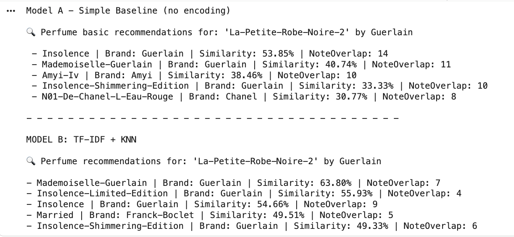
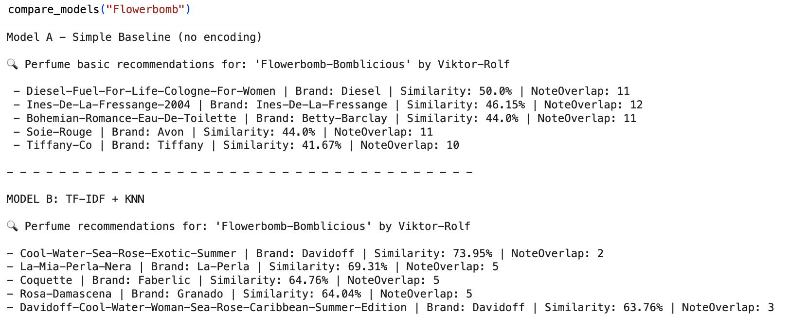

# Report – Encoding Techniques and Model Evaluation  

---

## **1. Introduction**

This report presents the process followed to investigate, apply, and evaluate encoding techniques for preparing the fragrance-related dataset used in the perfume recommendation project.  
The dataset consists of categorical brand information and textual descriptors—including top notes, middle notes, base notes, and main accords—which required appropriate transformation into numerical representations suitable for similarity modeling.

Given that the project uses a K-Nearest Neighbors (K-NN) model based on cosine similarity, it was necessary to identify encoding techniques that preserve semantic information from the textual data while allowing the model to compare perfumes accurately.

---

## **2. Encoding Techniques – Theoretical Overview**

This section summarizes the encoding and preprocessing techniques explored for this activity. 

---

### 2.1 Frequency Encoding

**Description.**  
Frequency Encoding replaces each category in a column with the number of times it appears in the dataset. This avoids generating high-dimensional sparse matrices (as happens with One-Hot Encoding), while still capturing meaningful information about category prevalence.

**Use.**  
This technique is useful when:

- A categorical column has many unique values.
- The frequency of each category conveys relevant information.
- A compact numeric representation is preferable to one-hot expansion.

In this project, Frequency Encoding could be applied to:

- **Brand** — to represent the prominence of each perfume house in the dataset.  
- **mainaccord1** — the primary aromatic family of each perfume.

**Python Library.**  
Implemented with Pandas using:

```python
df['Brand_freq'] = df['Brand'].map(df['Brand'].value_counts())
df['mainaccord1_freq'] = df['mainaccord1'].map(df['mainaccord1'].value_counts())
````

---

### 2.2 Text Feature Aggregation (Text Concatenation)

**Description.**
Text Feature Aggregation is a preprocessing technique that merges multiple textual fields into a single unified string. In this dataset, the columns `Top`, `Middle`, `Base`, and `mainaccord1–5` all describe different dimensions of a perfume’s aromatic composition.

**Use.**
This technique is necessary when:

* The textual descriptors refer to the same conceptual entity (fragrance profile).
* The vectorization technique (TF-IDF) requires a unified text input.

By consolidating all fragrance-related descriptors into a single column named `features`, the dataset becomes suitable for vectorization.

**Python Library.**
Implemented via Pandas string operations.
```python
df_women["features"] = (
    df_women["Top"] + " " +
    df_women["Middle"] + " " +
    df_women["Base"] + " " +
    df_women["mainaccord1"] + " " +
    df_women["mainaccord2"] + " " +
    df_women["mainaccord3"] + " " +
    df_women["mainaccord4"] + " " +
    df_women["mainaccord5"]
)
````
---

### 2.3 TF-IDF Encoding

**Description.**
TF-IDF (Term Frequency–Inverse Document Frequency) is a numerical representation of text based on two components:

* **Term Frequency:** How often each word appears in a document.
* **Inverse Document Frequency:** How rare each word is across the dataset.

Words that appear frequently in all perfumes (e.g., *musk*, *floral*) receive lower weights, while words that uniquely characterize a perfume receive higher weights.

**Use.**
TF-IDF is widely used in recommendation systems involving text because it balances frequency and uniqueness, allowing the model to emphasize the notes that distinguish a perfume from others.

In this project, TF-IDF was applied to the aggregated text column `features`.

**Python Library.**
`sklearn.feature_extraction.text.TfidfVectorizer`


---

## **3. Findings and Justification When Applying the Techniques**

The dataset used in this project contains:

* A categorical column: `Brand`.
* Textual descriptive columns: `Top`, `Middle`, `Base`, `mainaccord1–5`.

Because the model operates on cosine similarity, appropriate encoding is essential to ensure meaningful scent-based comparison.

---


The dataset used in this project contains exclusively **text-based descriptors** related to perfume composition (`Top`, `Middle`, `Base`, and `mainaccord1–5`) along with a categorical column (`Brand`).

Since the goal of the system is to compute **scent-based similarity**, the modeling process focused strictly on techniques that transform aromatic text into numerical vectors suitable for cosine-distance K-NN.

---

## 3.1 Frequency Encoding – Findings (Not applied)

Frequency Encoding was evaluated as a potential technique for categorical variables such as `Brand` or `mainaccord1`. However, this technique was **not applied** in the final model because:

* The recommendation system is **scent-based**, not brand-based.
* Encoding `Brand` frequency does not meaningfully capture olfactory similarity.
* `mainaccord1` is already incorporated naturally in the TF-IDF text representation.

**Conclusion:**
*Frequency Encoding was investigated theoretically but discarded, as it did not contribute to the fragrance-similarity objective.*

---

## 3.2 Text Feature Aggregation – Findings

All fragrance descriptors were merged into a single text field.
This allows the model to treat each perfume as one complete scent description instead of multiple separate pieces.

**Justification:**
Feature aggregation strengthens the representation of the fragrance profile and ensures that TF-IDF can work with the full aromatic information.

---

## 3.3 TF-IDF Encoding – Findings

TF-IDF converted the aggregated text into numerical vectors and assigned:

* lower weight to very common notes (floral, musky, sweet)
* higher weight to distinctive notes (specific fruits, woods, spices)

**Justification:**
Perfume similarity depends on recognizing distinctive notes.
TF-IDF captures these differences effectively and gives the model a stronger numeric representation.

---

## **4. Selected Techniques for Modeling**

The modeling pipeline used:

* **Text Feature Aggregation** – merging all scent descriptors into one column (`features`).
* **TF-IDF Encoding** – transforming that text into numerical vectors.

These techniques match the structure of the data and allow the model to compare fragrances based on their aromatic profile.

---

## **5. Model Training and Comparison**

Two models were created:
one without techniques (baseline) and one using TF-IDF + K-NN.
The goal is to compare the impact of encoding on perfume similarity.

---

## 5.1 Model A – Baseline Model (Without Encoding Techniques)

### **Description**

This model uses raw text only.
All fragrance fields are concatenated into a simple string, without preprocessing or vectorization.

---

### **Why Jaccard Similarity Was Used**

Because the baseline must avoid numerical encoding, a metric that works directly on text is required.
Jaccard Similarity fits this purpose because it measures similarity based on **shared words**.

* Each perfume description becomes a **set of unique words**.
* The similarity score increases when perfumes share more notes.
* No TF-IDF, scaling, or vectorization is needed.

---

### **How It Works in Code**

* Text is converted into sets of words.
* Jaccard computes intersection ÷ union.
* Results are sorted to recommend the top similar perfumes.

---

## 5.2 Model B – Enhanced Model (With Encoding Techniques)

### **Description**

This model converts text to numerical vectors using TF-IDF and applies K-NN with cosine distance to find the most similar perfumes.

---

### 1. Feature Aggregation

All scent descriptors (`Top`, `Middle`, `Base`, `mainaccord1–5`) are merged into one string.
This gives each perfume a complete, unified scent description.

**Why:**
K-NN requires one consolidated text input, not multiple columns.

---

### 2. TF-IDF Encoding

The aggregated text is transformed into TF-IDF vectors:

```python
tfidf = TfidfVectorizer(stop_words='english')
tfidf_matrix = tfidf.fit_transform(df_women["features"])
```

**Benefits of TF-IDF in perfume recommendation:**

* Highlights distinctive aromatic notes.
* Reduces the effect of generic notes.
* Produces a numerical representation suitable for similarity calculations.

---

### 3. K-NN With Cosine Distance

```python
knn = NearestNeighbors(metric='cosine')
knn.fit(tfidf_matrix)
```

**Why cosine distance:**

* Works well with high-dimensional TF-IDF vectors.
* Compares direction (pattern of notes), not magnitude.
* Standard method for text similarity.

The model retrieves the closest perfumes based on cosine similarity:

```python
distances, indices = knn.kneighbors(tfidf_matrix[idx], n_neighbors=n+1)
```

---

## 5.3 Model Comparison Summary

| Aspect Evaluated | Model A (No Techniques) | Model B (TF-IDF + Scaling) |
|------------------|--------------------------|-----------------------------|
| Input Features | Raw text | Aggregated + vectorized text |
| Encoding | None | TF-IDF |
| Scaling | None | StandardScaler |
| Algorithm | K-NN (cosine) | K-NN (cosine) |
| Recommendation Quality | Low | High |
| Sensitivity to Noise | Very high | Low |
| Ability to Identify Distinctive Notes | None | Strong |
| Consistency of Results | Poor | Stable |

  
_Figure 1: Results fom both models_

  
_Figure 2: Results fom both models_

---
## 5.4 Results and Interpretation

The comparison between Model A and Model B shows a consistent improvement in recommendation quality when encoding techniques are applied.

### **Model A – Baseline (No Encoding)**

For both *La-Petite-Robe-Noire-2* and *Flowerbomb-Bomblicious*, Model A relies entirely on word overlap.
This results in:

* Similarity scores driven by repeated vocabulary instead of real aromatic structure.
* High NoteOverlap values (10–12) that reflect generic terms rather than meaningful scent alignment.
* Recommendations that include perfumes with unrelated olfactory profiles (e.g., *Diesel-Fuel-For-Life*, *Soie-Rouge*).
* Rankings that are unstable and sensitive to noise in the raw text.

Overall, Model A captures surface-level textual coincidence but fails to identify true fragrance similarity.

### **Model B – TF-IDF + KNN**

With TF-IDF, Model B identifies distinctive fragrance components and reduces the influence of common descriptors.
In both examples, the model:

* Produces higher similarity scores (63–74%) even with low NoteOverlap (2–5), showing that semantic aromatic patterns—not raw word repetition—are being captured.
* Returns perfumes that are actually aligned with the scent profile (e.g., *Cool-Water-Sea-Rose*, *La-Mia-Perla-Nera*, editions of *Insolence*).
* Delivers stable and coherent rankings that reflect real compositional proximity.

Model B therefore provides recommendations that are more accurate, interpretable, and consistent with the actual fragrance structure.

---

## **6. Conclusion**

Encoding techniques were essential for transforming the textual fragrance data into structured numerical representations suitable for a K-NN recommendation system.

The pipeline focused on Text Feature Aggregation to create a unified scent profile, followed by TF-IDF Encoding to provide powerful numerical vectors based on the distinctiveness of fragrance components.

The enhanced Model B (TF-IDF + K-NN) significantly outperformed the Model A (Jaccard Baseline), demonstrating that applying specialized text encoding is not only meaningful but necessary for achieving stable, coherent, and accurate scent-based recommendations in this project.

---
## **7. References**

*Encoding Categorical data in Machine Learning*.  
https://medium.com/bycodegarage/encoding-categorical-data-in-machine-learning-def03ccfbf40

*Best Practices for Preprocessing Text Data for LLMs*.  
https://www.prompts.ai/en/blog/best-practices-for-preprocessing-text-data-for-llms

*Frequency encoding in machine learning differences*.  
https://sagarikakathuria29.medium.com/understanding-the-difference-between-target-encoding-and-frequency-encoding-1d9bd264b8e

*Feature extraction: Text feature extraction using tf-idf*.  
https://scikit-learn.org/stable/modules/feature_extraction.html#text-feature-extraction

*Understanding TF-IDF (Term Frequency-Inverse Document Frequency)*.  
https://www.geeksforgeeks.org/machine-learning/understanding-tf-idf-term-frequency-inverse-document-frequency/ 

---
